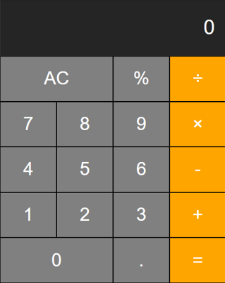
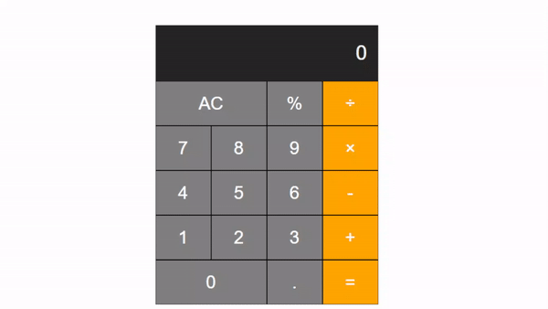
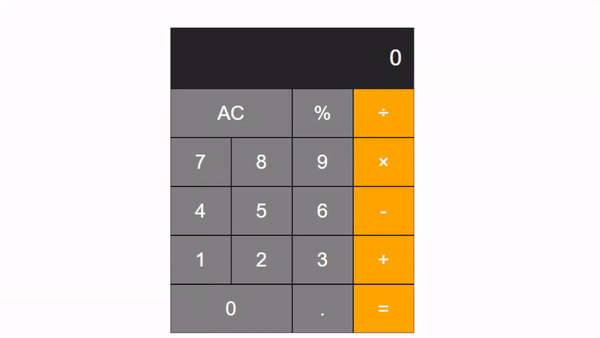

# Kalkulator

## Aliza Nurazizah Azhari

<br>

Kalkulator ini dapat menerima input dari tombol-tombol dan menampilkannya di layar display program kalkulator. Program kalkulator memiliki fungsi kalkulasi berupa pengurangan, penjumlahan, perkalian dan pembagian serta memiliki angka 0 dan angka 1 sampai 9. Program ini hanya dapat melakukan suatu kalkulasi setidaknya 2 angka dan satu operator, misal menampilkan hasil dari 20 : 2. Program ini tidak menampilkan angka yang diawali dengan angka nol, misal 078. Program ini juga memiliki fungsi desimal dan  persen yang bisa dijalankan dengan baik. Selain itu, program juga memiliki fungsi CLEAR atau AC yang dapat membersihkan riwayat kalkulasi sebelumnya. 

<br>

## Cara Menggunakan Kalkulator
Langkah-langkah untuk menguji program kalkulator ini adalah sebagai berikut.

1. Clone repository ini dengan menjalankan command berikut di terminal/cmd/Git Bash

```sh
$ git clone https://github.com/alizanurazizah/kalkulator-kmmi.git
```

2. Buka folder `ALIZA-NURAZIZAH-AZHARI_SKEMA_JUNIOR_PROGRAMMER_2021-10-10` yang berada di dalam folder `kalkulator-kmmi` hasil dari clone.
3. Di dalam folder tersebut, buka index.html pada chrome.
4. Akan diperlihatkan tampilan kalkulator sebagai berikut.



5. Uji coba kalkulator dengan menekan angka ‘0’ lalu angka 5


6. Uji coba kembali kalkulator dengan melakukan operasi hitung pada bilangan bulat



7. Setelah memperoleh hasil dari perhitungan, tekan tombol “AC” untuk mereset kalkulator.


8. Uji coba kalkulator dengan melakukan operasi hitung pada bilangan desimal


9. Uji coba kalkulator dengan melakukan operasi hitung 0.1 + 0.2


Dari hasil perhitungan diperoleh hasil kalkulasi yang tidak akurat.

10. Uji coba dengan mengklik 2 kali pada operator secara beruntun.

